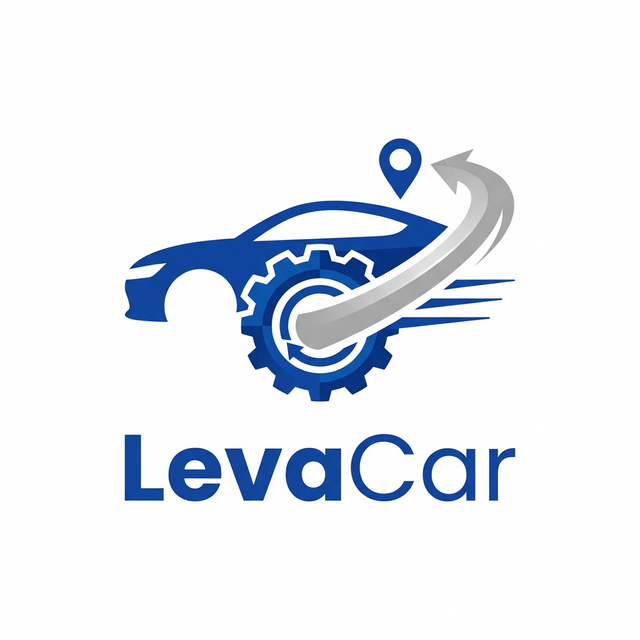

# 🚗 LevaCar



> **LevaCar** é o seu parceiro inteligente para logística automotiva. Um aplicativo estilo "Uber para oficinas" que conecta proprietários de veículos a motoristas parceiros para os serviços de leva-e-traz em manutenções.

[](https://expo.dev/)
[](https://reactnative.dev/)
[](https://supabase.com/)
[](https://www.typescriptlang.org/)

---

## ✨ Funcionalidades

- 📍 **Mapa em Tempo Real:** Acompanhe o motorista parceiro em tempo real durante o trajeto entre sua casa e a oficina.
- 🔐 **Autenticação Flexível:** Sistema de login e cadastro completo via e-mail/senha com Supabase Auth.
- 🛂 **Multi-perfis:** Fluxos de interface específicos para:
  - **Clientes:** Solicitar serviços de leva, traz ou ambos.
  - **Motoristas (Colaboradores):** Aceitar corridas e atualizar status da manutenção.
  - **Mecânicas:** Visualizar entrada e saída de veículos.
- 📝 **Validação de Documentos:** Cadastro de motoristas com suporte para validação de CNH.
- 📱 **Interface Adaptativa:** Layout moderno com suporte a Safe Areas, garantindo que o app se ajuste perfeitamente em qualquer tela.

## 🛠️ Tecnologias Utilizadas

- **Frontend:** React Native com [Expo Router](https://docs.expo.dev/router/introduction/) (Navegação baseada em arquivos).
- **Backend-as-a-Service:** [Supabase](https://supabase.com/) para:
  - Banco de Dados PostgreSQL.
  - Autenticação e Autorização.
  - Storage (Fotos de CNH e Perfil).
  - WebSockets para atualizações em Real-time.
- **Mapas:** [React Native Maps](https://github.com/react-native-maps/react-native-maps) com integração de GPS.
- **Estilização:** StyleSheet nativo do React Native.

## 🚀 Começando

### Pré-requisitos
- [Node.js](https://nodejs.org/) (v18+)
- [Git](https://git-scm.com/)
- Aplicativo [Expo Go](https://expo.dev/expo-go) instalado no celular.

### Instalação

1. Clone o repositório:
   ```bash
   git clone git@github.com:cdaguiar23/levacar-app.git
   cd levacar-app
   ```

2. Instale as dependências:
   ```bash
   npm install
   ```

3. Configure o Supabase:
   Renomeie ou crie um arquivo de configuração com suas credenciais do Supabase:
   - `EXPO_PUBLIC_SUPABASE_URL`
   - `EXPO_PUBLIC_SUPABASE_ANON_KEY`

### Executando o Projeto

1. Inicie o Metro Bundler:
   ```bash
   npx expo start
   ```

2. Abra o app no seu celular escaneando o QR Code exibido no terminal.

## 📦 Build (Geração do APK)

Este projeto está configurado para builds via **EAS (Expo Application Services)**.

Para gerar um novo APK de teste:
```bash
eas build -p android --profile preview
```

---

## 📄 Licença

Este projeto está sob a licença MIT. Veja o arquivo [LICENSE](LICENSE) para mais detalhes.

---
Desenvolvido com 💙 para facilitar a vida de quem ama seu carro.
